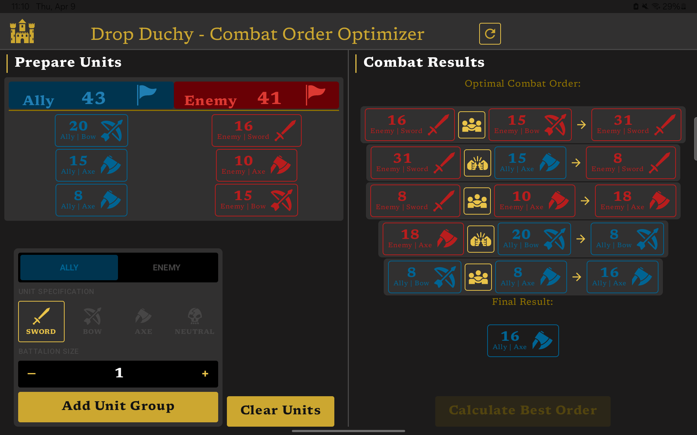

# ⚔️ Drop Duchy Combat Order Optimizer

An Android app that calculates the optimal combat order for unit groups based on deterministic combat mechanics inspired by *Drop Duchy*.

---

## 📱 Overview

This tool calculates the best sequence to resolve combat between allied and enemy units, maximizing surviving allies or minimizing enemy units.

The app simulates all possible permutations of unit order and selects the most optimal outcome. HELL YEAH BRUTE FORCE!

---

## ✨ Features

* 🧩 Add unit groups (Ally / Enemy, Type, Count)
* ⚔️ Simulate combat resolution step-by-step
* 🧠 Compute optimal order using permutation search
* 📊 Visual breakdown of each combat step
* 🏆 Final result display with remaining units

---

## 🧠 How It Works

* Units follow a rock-paper-scissors system:

  * Sword > Bow
  * Bow > Axe
  * Axe > Sword
* Effectiveness multiplier: **1.5x**
* Combat is resolved sequentially based on selected order
* Same-side units merge with type rules
* All permutations are evaluated (brute-force)

---

## 🖼️ Screenshots

---

## 🛠️ Tech Stack

* Kotlin
* Jetpack Compose
* Material 3

---

## 🚀 Getting Started

1. Clone the repo
2. Open in Android Studio
3. Sync Gradle
4. Run on emulator or device

---

## 📌 TODOS

UI polish and animations
Passive abilities support
Save/load scenarios
Performance optimizations (pruning permutations)
Building APK and upload to Play Store!

---

## ⚠️ Disclaimer

This is a fan-made tool inspired by *Drop Duchy*.
All original game assets and mechanics belong to their respective creators.

---

## 👨‍💻 Author

Built by Ruben Garcia — learning Android through real-world problem solving.

